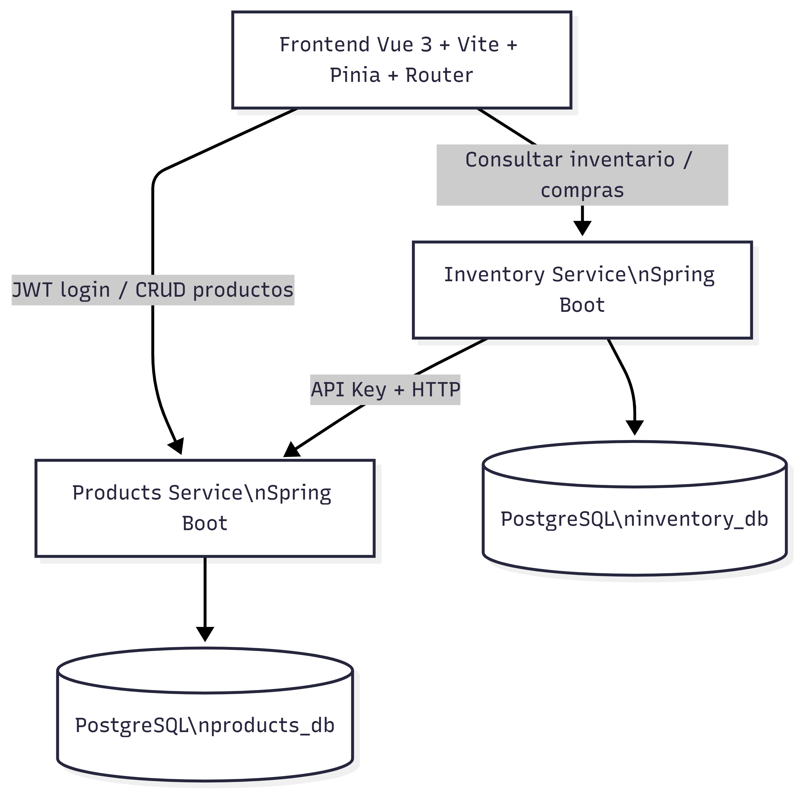

# Diagrama C4 - Tienda Microservicios

## Nivel 2 - Contenedores

## Descripción breve

- El frontend consume Products Service e Inventory Service.
- Inventory Service consulta Products Service mediante API Key.
- Cada microservicio tiene su propia base de datos PostgreSQL.